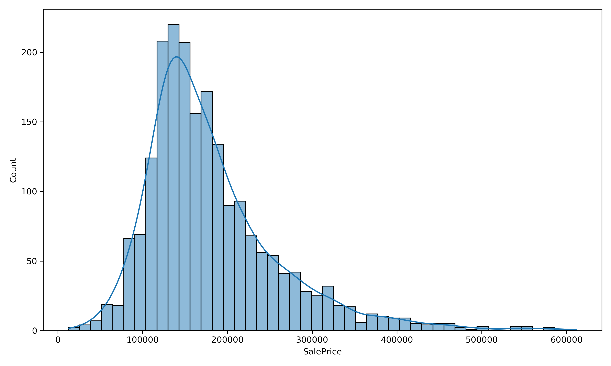
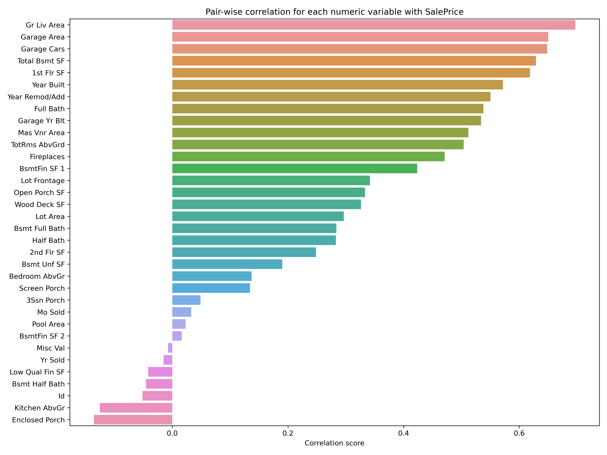
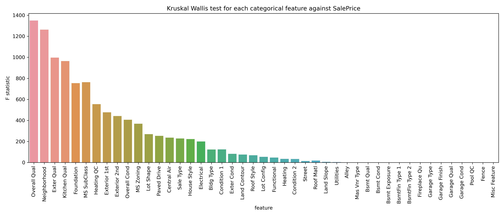
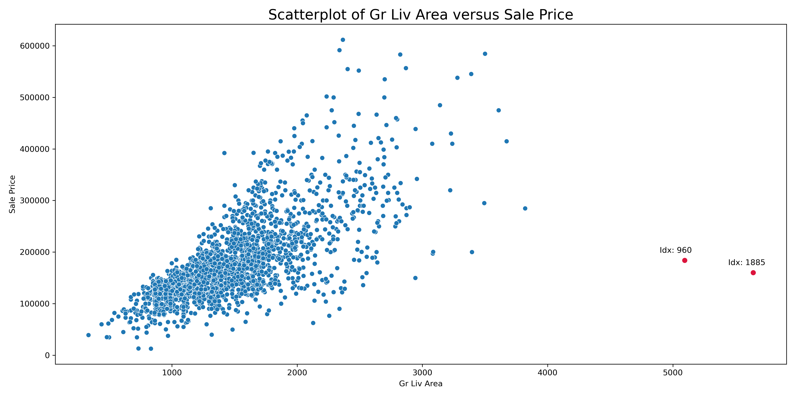
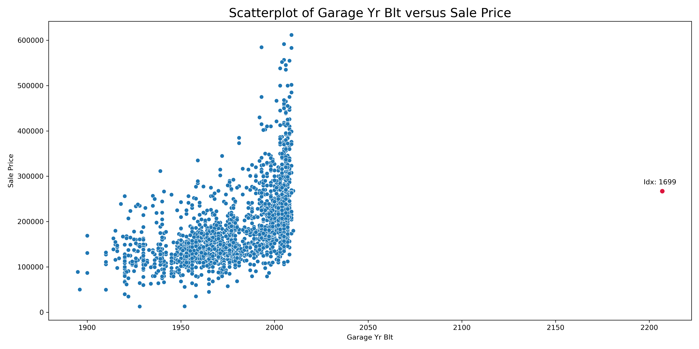
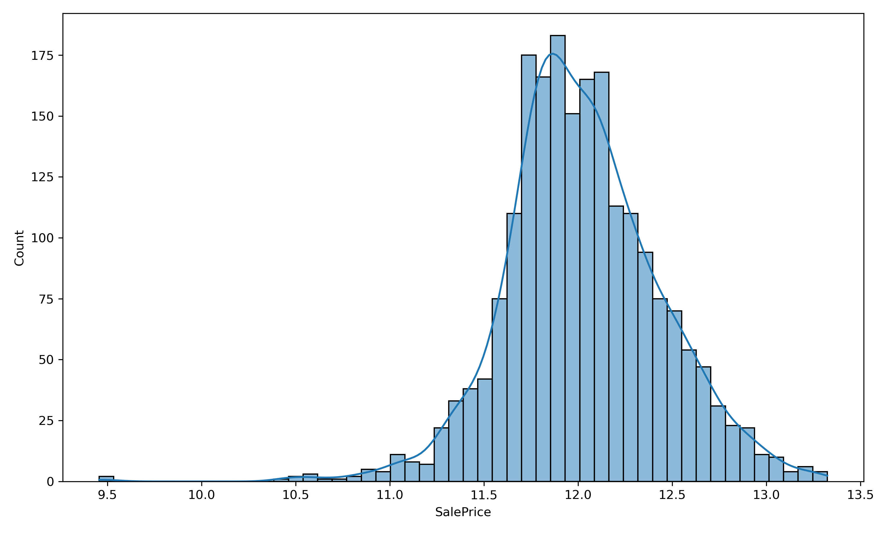
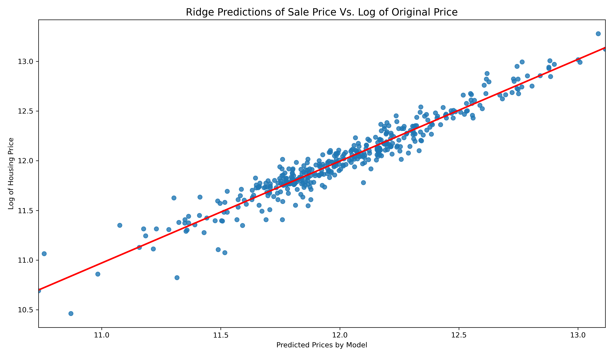
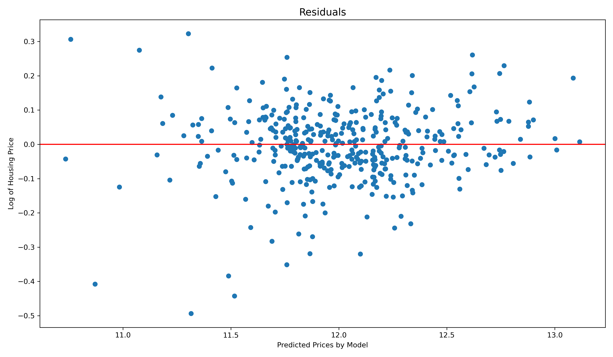
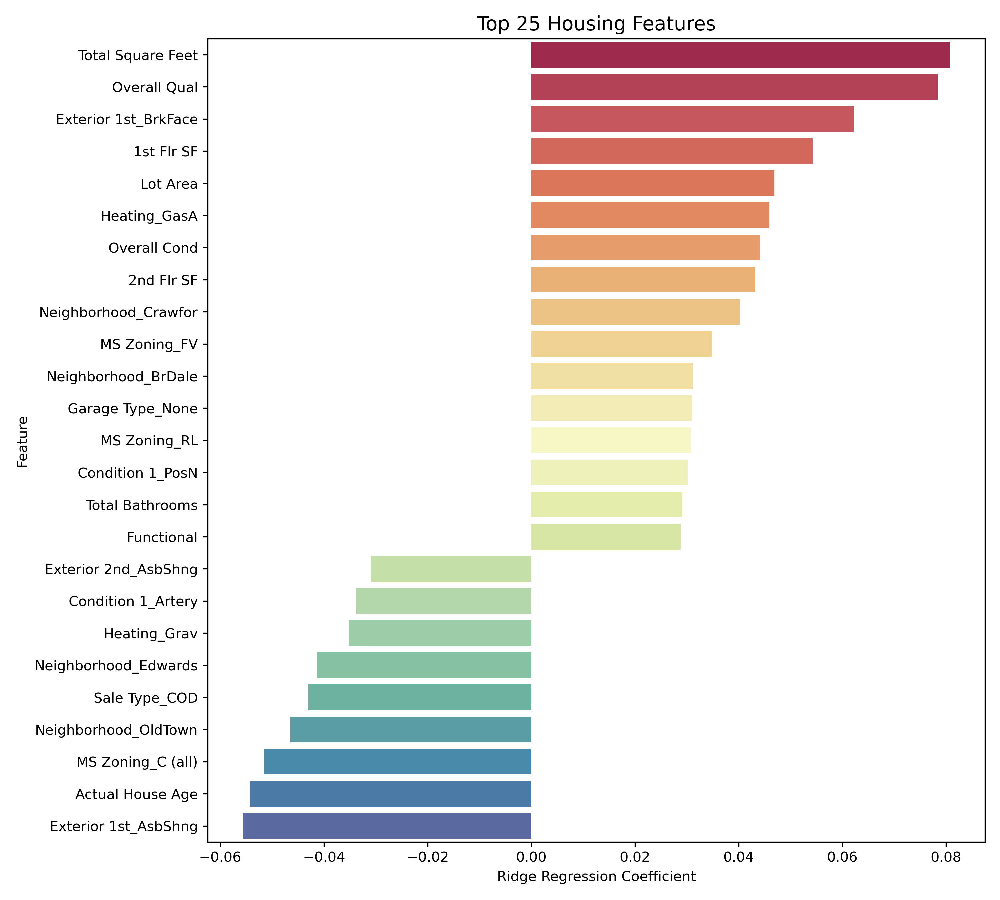

#  Project 2: Ames Housing Data and Kaggle Challenge

## Project 2: Ames Housing Data and Kaggle Challenge

### Details
Name: Wenna Loo Yan Ying

Class: DSIF-SG-1

## Table of contents
* [Problem Statement](#Problem-Statement)
* [Background](#Background)
* [Performance Measure](#Performance-Measure)
* [Dataset](#Dataset)
* [EDA Summary](#EDA-Summary)
* [Outliers](#Outliers)
* [Missing Data](#Missing-Data)
* [Feature Engineering](#Feature-Engineering)
* [Modelling](#Modelling)
* [Production Model](#Production-Model)
* [Overall Evaluation](#Overall-Evaluation)
* [Project Structure](#Project-Structure)

## Problem Statement
XYZ Housing Investing Corporation is an entity that focuses the majority of its business on investing in residential properties. As part of the newly hired data science team working in the XYZ Housing Investing Corporation, we have been tasked to use Ames housing dataset to build a model that predicts the price of houses in the city. The Ames housing dataset describes features of houses sold in Ames, Iowa from 2006 to 2010. The model’s output (a prediction of a house sale price) will be fed to another Machine Learning system, along with many other signals. This downstream system will determine whether it is worth investing in a given residential property or not. Getting this right is critical, as it directly affects revenue.

### Background
The housing prices are currently estimated manually by experts: a team gathers up-to-date information about a residential property, and estimates the sale price by manually assessing key characteristics that will most likely influence it. This is costly and time-consuming, and their estimates are not great; in cases where they manage to find out the actual eventual sale price of the property, they often realise that their estimates were off by more than 20%. This is why the company thinks that it would be useful to train a model to predict a house sale price. 

This is clearly a typical supervised learning task, since we are given labeled training examples (the expected output, i.e., SalePrice). It is also a typical regression task, since we are asked to predict a continuous value. More specifically, this is a multiple regression problem, since the system uses multiple features to make a prediction (i.e., it will use the year built, year remodel, neigbourhood etc.). It is also a univariate regression problem, since we are only trying to predict a single value for each observation. 


### Performance Measure
We will evaluate the performance of our model using Root Mean Square Error (RMSE) as the North Star metric.

The mathematical formula to compute the RMSE:

<a href="https://www.codecogs.com/eqnedit.php?latex=RMSE(\mathbf{y},\hat{\mathbf{y}})&space;=&space;\sqrt{\frac{1}{n}\sum_{i=1}^n(y_i-\hat{y}_i)^2}" target="_blank"></a>

Our goal is to get RMSE as close to 0 as possible.

RMSE gives an idea of how much error the model typically makes in its predictions. In other words, it tells us how concentrated the data is around the line of best fit.


---

## Dataset
The Ames housing dataset contains information from the Ames Assessor’s Office used in computing the value of individual residential properties sold in Ames, Iowa from 2006 to 2010, as well as the actual eventual sale prices for the properties. The dataset contains information on 2929 observations, and 81 variables. The data has 81 columns which include 22 nominal, 23 ordinal, 14 discrete, and 20 continuous variables (and 2 additional observation identifiers).
- Nominal (categorical), meaning they are non-numerical and lack clear-cut order (Examples: Neighborhood, Type of roofing).
- Ordinal (categorical), meaning they are categorical but have a clear order (Example: Heating Quality (Excellent, Good, Average, Poor)).
- Discrete, meaning they are numerical but at set intervals (Example: Year Built, Number of Fireplaces). 
- Continuous, meaning they are numerical and can theoretically take any value in a range (Example: 1st Floor Square Feet).


### Data Dictionary
<details><summary>Click to expand</summary><p>

|Attribute|Variable Type |Dataset|Description|
|---|---|---|---|
|**Id**|*Discrete*|Ames Housing|Unique ID for each property|
|**PID**|*Nominal*|Ames Housing|Parcel identification number  - can be used with city web site for parcel review|
|**MS SubClass**|*Nominal*|Ames Housing|Identifies the type of dwelling involved in the sale|
|**MS Zoning**|*Nominal*|Ames Housing|Identifies the general zoning classification of the sale|
|**Lot Frontage**|*Continuous*|Ames Housing|Linear feet of street connected to property|
|**Lot Area**|*Continuous*|Ames Housing|Lot size in square feet|
|**Street**|*Nominal*|Ames Housing|Type of road access to property|
|**Alley**|*Nominal*|Ames Housing|Type of alley access to property|
|**Lot Shape**|*Ordinal*|Ames Housing|General shape of property|
|**Land Contour**|*Nominal*|Ames Housing|Flatness of the property|
|**Utilities**|*Ordinal*|Ames Housing|Type of utilities available|
|**Lot Config**|*Nominal*|Ames Housing|Lot configuration|
|**Land Slope**|*Ordinal*|Ames Housing|Slope of property|
|**Neighborhood**|*Nominal*|Ames Housing|Physical locations within Ames city limits (map available)|
|**Condition 1**|*Nominal*|Ames Housing|Proximity to various conditions|
|**Condition 2**|*Nominal*|Ames Housing|Proximity to various conditions (if more than one is present)|
|**Bldg Type**|*Nominal*|Ames Housing|Type of dwelling|
|**House Style**|*Nominal*|Ames Housing|Style of dwelling|
|**Overall Qual**|*Ordinal*|Ames Housing|Rates the overall material and finish of the house|
|**Overall Cond**|*Ordinal*|Ames Housing|Rates the overall condition of the house|
|**Year Built**|*Discrete*|Ames Housing|Original construction date|
|**Year Remod/Add**|*Discrete*|Ames Housing|Remodel date (same as construction date if no remodeling or additions)|
|**Roof Style**|*Nominal*|Ames Housing|Type of roof|
|**Roof Matl**|*Nominal*|Ames Housing|Roof material|
|**Exterior 1st**|*Nominal*|Ames Housing|Exterior covering on house|
|**Exterior 2nd**|*Nominal*|Ames Housing|Exterior covering on house (if more than one material)|
|**Mas Vnr Type**|*Nominal*|Ames Housing|Masonry veneer type|
|**Mas Vnr Area**|*Continuous*|Ames Housing|Masonry veneer area in square feet|
|**Exter Qual**|*Ordinal*|Ames Housing|Evaluates the quality of the material on the exterior |
|**Exter Cond**|*Ordinal*|Ames Housing|Evaluates the present condition of the material on the exterior|
|**Foundation**|*Nominal*|Ames Housing|Type of foundation|
|**Bsmt Qual**|*Ordinal*|Ames Housing|Evaluates the height of the basement|
|**Bsmt Cond**|*Ordinal*|Ames Housing|Evaluates the general condition of the basement|
|**Bsmt Exposure**|*Ordinal*|Ames Housing|Refers to walkout or garden level walls|
|**BsmtFin Type 1**|*Ordinal*|Ames Housing|Rating of basement finished area|
|**BsmtFin SF 1**|*Continuous*|Ames Housing|Type 1 finished square feet|
|**BsmtFin Type 2**|*Ordinal*|Ames Housing|Rating of basement finished area (if multiple types)|
|**BsmtFin SF 2**|*Continuous*|Ames Housing|Type 2 finished square feet|
|**Bsmt Unf SF**|*Continuous*|Ames Housing|Unfinished square feet of basement area|
|**Total Bsmt SF**|*Continuous*|Ames Housing|Total square feet of basement area|
|**Heating**|*Nominal*|Ames Housing|Type of heating|
|**Heating QC**|*Ordinal*|Ames Housing|Heating quality and condition|
|**Central Air**|*Nominal*|Ames Housing|Central air conditioning|
|**Electrical**|*Ordinal*|Ames Housing|Electrical system|
|**1st Flr SF**|*Continuous*|Ames Housing|First Floor square feet|
|**2nd Flr SF**|*Continuous*|Ames Housing|Second floor square feet|
|**Low Qual Fin SF**|*Continuous*|Ames Housing|Low quality finished square feet (all floors)|
|**Gr Liv Area**|*Continuous*|Ames Housing|Above grade (ground) living area square feet|
|**Bsmt Full Bath**|*Discrete*|Ames Housing|Basement full bathrooms|
|**Bsmt Half Bath**|*Discrete*|Ames Housing|Basement half bathrooms|
|**Full Bath**|*Discrete*|Ames Housing|Full bathrooms above grade|
|**Half Bath**|*Discrete*|Ames Housing|Half baths above grade|
|**Bedroom AbvGr**|*Discrete*|Ames Housing|Bedrooms above grade (does NOT include basement bedrooms)|
|**Kitchen AbvGr**|*Discrete*|Ames Housing|Kitchens above grade|
|**Kitchen Qual**|*Ordinal*|Ames Housing|Kitchen quality|
|**TotRms AbvGrd**|*Discrete*|Ames Housing|Total rooms above grade (does not include bathrooms)|
|**Functional**|*Ordinal*|Ames Housing|Home functionality (Assume typical unless deductions are warranted)|
|**Fireplaces**|*Discrete*|Ames Housing|Number of fireplaces|
|**Fireplace Qu**|*Ordinal*|Ames Housing|Number of fireplaces|
|**Garage Type**|*Nominal*|Ames Housing|Garage location|
|**Garage Yr Blt**|*Discrete*|Ames Housing|Year garage was built|
|**Garage Finish**|*Ordinal*|Ames Housing|Interior finish of the garage|
|**Garage Cars**|*Discrete*|Ames Housing|Size of garage in car capacity|
|**Garage Area**|*Continuous*|Ames Housing|Size of garage in square feet|
|**Garage Qual**|*Ordinal*|Ames Housing|Garage quality|
|**Garage Cond**|*Ordinal*|Ames Housing|Garage condition|
|**Paved Drive**|*Ordinal*|Ames Housing|Paved driveway|
|**Wood Deck SF**|*Continuous*|Ames Housing|Wood deck area in square feet|
|**Open Porch SF**|*Continuous*|Ames Housing|Open porch area in square feet|
|**Enclosed Porch**|*Continuous*|Ames Housing|Enclosed porch area in square feet|
|**3Ssn Porch**|*Continuous*|Ames Housing|Three season porch area in square feet|
|**Screen Porch**|*Continuous*|Ames Housing|Screen porch area in square feet|
|**Pool Area**|*Continuous*|Ames Housing|Pool area in square feet|
|**Pool QC**|*Ordinal*|Ames Housing|Pool quality|
|**Fence**|*Ordinal*|Ames Housing|Fence quality|
|**Misc Feature**|*Nominal*|Ames Housing|Miscellaneous feature not covered in other categories|
|**Misc Val**|*Continuous*|Ames Housing|Dollar-Value of miscellaneous feature|
|**Mo Sold**|*Discrete*|Ames Housing|Month Sold (MM)|
|**Yr Sold**|*Discrete*|Ames Housing|Year Sold (YYYY)|
|**Sale Type**|*Nominal*|Ames Housing|Type of sale|
|**SalePrice**|*Continuous*|Ames Housing|Sale price $$ (target)|
</p></details>

---

## EDA Summary
The test set has been set aside and we are only exploring the training set.

### 1. The target variable: SalePrice

[](./assets/SalePrice_histogram_plot.png)

We see that SalePrice is positively skewed (skewed right): its right tail is longer and most of the distribution is at the left.

### 2. The relationship between our numeric features and target variable: SalePrice
The most important numeric features:
[](./assets/important_numerical_features.png)

* Firstly, we can see that **'Above Grade' Living Area (this is the proportion of the house that is not in a basement) has the strongest positive correlation with SalePrice** among all the numeric features. From this we can infer that houses with large livable space above the ground are generally more expensive. 
* Secondly, **the size of the garage (both in terms of number of cars and area in square feet) have a strong positive correlation with SalePrice.** This suggests that houses with larger garage space tends to be more expensive, and vice versa. Having a garage can increase the valuation of a house. 
* Thirdly, **the actual age (in terms of year built) and effective age (in terms of remodel date) of the house have a strong positive correlation with SalePrice.** Typically, homes that are newer appraise at a higher value.

Overall, we can see that variables associated to home size, usable space, and age of a house are critical in influencing sale price. 


### 3. The relationship between our categorical features and target variable: SalePrice
The most important categorical features:

[](./assets/important_categorical_features.png)

5 of those most important categorical features are: `Overall Qual`, `Neighborhood`, `Exter Qual`, `Bsmt Qual`, and `Kitchen Qual`. We noticed that the quality variables are important in influencing sale price. We can also confirm the real estate mantra of "location, location, location" as `Neighborhood` appears to have the second greatest influence on sale price.

---

## Outliers
There are a number of outliers within the data -- specifically these are properties that have more than 4000 square feet.

[](./assets/outliers_gr_liv_area.png)

The two houses seemed to be unusual sales (very large houses priced relatively appropriately). We will proceed to remove these 2 unusual observations from the data set.

There is also an unsual observation whereby the maximum value for `Garage Yr Blt` is 2207.

[](./assets/outliers_garage_yr_built.png)

The unusual observation is clearly a data entry error. Hence, we will assign the original construction date to `Garage Yr Blt`.

---

## Missing Data
Most of the missing data corresponds to the absence of a feature. For example, the `PoolQC` variable has the most missing values. The high number of missing values here makes sense as in reality only a small proportion of houses will have a pool. These values are imputed as 0 or "None" depending on its data type. 

For houses with a feature present but have missing values, the strategy is to handle them based on data types:
* Missing numerical values: Multiple imputation using IterativeImputer in sklearn
* Missing categorical values: KNN imputation using KNNImputer in sklearn

---

## Feature Engineering
The following new input features are created from existing features:
* Total Bathrooms: Total number of bathrooms in a house 
  - `Full Bath` + 0.5*`Half Bath` + `Bsmt Full Bath` + 0.5 * `Bsmt Half Bath`
* Bedrooms per Room AbvGr: Bedrooms per room above grade
  - `Bedroom AbvG` / `TotRms AbvGrd`
* Total Square Feet: Total living space above and below ground.
  - `Gr Liv Area` + `Total Bsmt SF`
* Binning Neigborhood: New ordinal feature that classifies the type of neighborhood
  - 'Cheap', 'Affordable', 'Expensive'
* Total Porch SF: Total square feet of all porch areas
  - `Open Porch SF` + `Enclosed Porch` + `3Ssn Porch` + `Screen Porch`
* Effective House Age: The effective age (in terms of remodel date) of the house
  - `Yr Sold` - `Year Remod/Add`
* Actual House Age: The actual age (in terms of year built) of the house.
  - `Yr Sold` - `Year Built`
* Remodeled: New nominal feature that indicates whether the house has been remodeled
  - 0 = No Remodeling, 1 = Remodeling
* IsNew: New nominal feature that indicates whether the house is brand new
  - 0 = Not new, 1 = New
* HasFence: New nominal feature that indicates whether the house has a fence
  - 0 = No Fence, 1 = Fence
* HasPool: New nominal feature that indicates whether the house has a pool
  - 0 = No Pool, 1 = Pool


### Natural log-transformation of SalePrice 
We also undertook a log transformation of the highly skewed SalePrice target variable.

[](./assets/log_SalePrice_histogram_plot.png)

The histogram of log sale prices appears to be more symmetrical, with less extreme values.

---

## Modelling

### Model Baseline
We have set our baseline as the mean of log SalePrice.

### Model Training
We used regression models to predict the SalePrice of a house. Various preprocessing steps (such as: dropping highly correlated variables to reduce multicolinearity, normalising numeric predictors, label encoding, one-hot encoding, remove features with little/no variance & feature scaling) were applied to the features for all models. The resulting model is a log-log linear model, meaning a log dependent variable with at least one predictors that are log transformed.

We created solutions from a mix of baseline and advanced models. 80% data was used for training the model, and 20% was reserved for testing. 
We fit four regression algorithms:
* Linear
* Lasso
* Ridge
* Elastic Net

Table I. Evaluation metric of four regression algorithms:

Model | Mean RMSE score of 5 runs (log scale)
| :---: | :---: 
Linear Regression  | 18268020762.451725
Ridge Regression (with α = 23.101) | 0.12315811477681553
Lasso Regression (with α = 0.00079) | 0.12408811804339819
Elastic Net (with α = 0.0155, l1_ratio = 0.0219) | 0.12331348479948179

---

## Production Model
After applying 5-folds cross validation, it is clear that Ridge Regression model has the best performance in terms of RMSE score and it outperformed the baseline. Hence, we will use Ridge Regression to create our production model.

[](./assets/ridge_predictions_vs_original.png)

We can see that the line of best fit passes through most of the points.

[](./assets/ridge_residual_plot.png)

The residual plot shows a fairly random pattern - supports the assumption of linear model. We are able to see a consistent variance between our low predictions and our high predictions (homoscedasticity).

### Features of Importance
The top 25 most important predictors:

[](./assets/top_25_predictors.png)

The top predictive features that we see here are very plausible. The model coefficients imply that the ten largest effects on house prices in Ames were (in descending order) the total square feet (positive), overall quality (positive), houses with brick face exterior (positive), houses with asbestos shingles exterior (negative), 1st floor square feet (positive), actual house age (negative), properties zoned as commerical (negative), lot area (postive), houses located in Old Town (negative), and houses with forced air heating system (postive).

---

## Overall Evaluation
Based on the insights from our exploratory data analysis (EDA), we zoomed in on the various features that are likely to influence SalePrice. There followed by data cleaning, preprocessing and feature engineering to prepare our data for model training. We also undertook a log transformation of the highly skewed SalePrice target variable.

We tried to predict the SalePrice of a house with regression models. The engineered data was then run through four regression algorithms:
* Linear
* Lasso
* Ridge
* Elastic Net

After applying 5-folds cross validation, it is clear that Ridge Regression model has the best performance in terms of RMSE score and it outperformed the baseline. Hence, we chose the Ridge Regression to create our production model.

### Recommendations
Recall that the housing prices are currently estimated manually by a team of experts. Based on our model, we would recommend the following to the experts who are looking into improving their manual estimation on housing prices:
* The assorted property size variables, namely total square feet, lot area, 1st floor square feet, and 2nd floor square feet, are important determinants of increasing house prices. 
* Similarly, build quality and condition are among the important determinants of increasing house prices.
* Neighborhoods such as Crawford & Briardale are good investments, while Old Town is a bad investment.
* Asbestos shingles exterior can severely impact on the value of a home.
* Older homes are valued at lower prices, as the value depreciates over time.


### Limitations
Although our production model generalises well to the houses sold in Ames, Iowa, it probably will not generalise well to other cities, given that each city tends to differ greatly in terms of geographical features, climatic conditions, and cultural preferences.

Another point to note is that this model works well for houses sold from 2006 to 2010. Housing prices would have varied over the years. Hence, our model would need to be retrained using more recent data.

### Future Steps

We could try dropping some of the less useful features/ try out other machine learning algorithmns to improve model performance. After tweaking the production model for a while, we will eventually have a system that performs sufficiently well. Thereafter, we will want to test our model for deployment by evaluating against the experts’ price estimate. Finally, we will need to present our solution to the management for approval to launch the model. When the model is eventually launched into production, it will help to free up some time for the team of experts who are manually estimating housing prices, so that they can use their expertise on more productive tasks.

---

## Project Structure

```
    .
    ├── assets: Images
    ├── code: Source files 
    │    ├── 01_EDA_and_Cleaning.ipynb
    │    ├── 02_Preprocessing_and_Feature_Engineering.ipynb
    │    ├── 03_Model_Selection_Tuning_and_Insights.ipynb   
    │    └── 04_Kaggle_Submissions.ipynb
    ├── datasets: The Ames Housing dataset (provided datasets)
    │    ├── train.csv
    │    └── test.csv
    ├── datasets_cleaned: Intermediate files
    │    ├── train_cleaned.csv
    │    └── test_cleaned.csv
    ├── datasets_final: Final file format used to train models
    │    ├── train_final.csv
    │    └── test_final.csv
    ├── kaggle_submissions: Submission file format for Kaggle Challenge
    │    ├── submission_lasso.csv
    │    └── submission_ridge.csv
    ├── presentation: Presentation slides
    └── README.md
   
```
